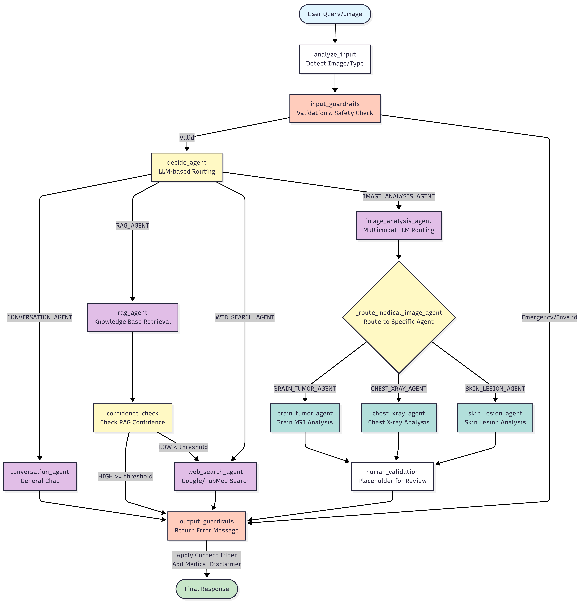

# MediAssist AI - Medical Assistant Application

A comprehensive AI-powered medical assistant application built with FastAPI that provides intelligent medical information retrieval, image analysis, and conversational AI capabilities.

## 🏥 Overview

MediAssist AI is a multi-agent medical assistant system that combines various AI technologies to provide:

- **Intelligent Medical Chat**: Conversational AI for general health questions
- **Medical Image Analysis**: Specialized AI models for brain MRI, chest X-ray, and skin lesion analysis
- **Knowledge Retrieval**: RAG (Retrieval-Augmented Generation) system for medical document search
- **Real-time Web Search**: Access to current medical information and research
- **Voice Processing**: Speech-to-text and text-to-speech capabilities
- **Content Safety**: Comprehensive guardrails and content filtering

## 🚀 Key Features

### Multi-Agent Architecture
- **Conversation Agent**: Handles general chat and non-medical questions
- **RAG Agent**: Retrieves information from medical knowledge base
- **Web Search Agent**: Searches PubMed and Google for current medical information
- **Three Image Analysis Agents**: Specialized models for different medical imaging types
- **Voice Agent**: Processes audio input/output using Azure Speech Services

### Medical Image Analysis
- **Brain Tumor Detection**: Analyzes brain MRI images for tumor classification
- **Chest X-ray Analysis**: Detects pneumonia, cardiomegaly, and other lung conditions
- **Skin Cancer Detection**: Analyzes skin cancer stages

### Safety & Compliance
- **Input Validation**: Comprehensive input sanitization and validation
- **Content Filtering**: Profanity and inappropriate content detection
- **Medical Disclaimers**: Automatic medical advice disclaimers
- **Security Checks**: XSS, SQL injection, and other security threat detection

## 🏗️ Multi-Agent Orchestration Architecture

The system uses a LangGraph-based workflow to intelligently route queries to specialized agents. The orchestrator processes inputs through multiple stages including validation, agent selection, execution, and output safety checks.



### Workflow Stages

1. **Input Processing**: Analyzes input for images and validates content
2. **Agent Decision**: LLM-based intelligent routing to appropriate agent
3. **Agent Execution**: Specialized agents process the query
4. **Confidence Routing**: RAG results are evaluated; low confidence triggers web search fallback
5. **Medical Image Routing**: Multimodal LLM routes medical images to specialized analysis agents
6. **Output Safety**: Content filtering and medical disclaimers applied before response

### Routing Logic

- **Text Queries**: Routed to Conversation, RAG, or Web Search agents based on query type
- **Medical Images**: Routed through multimodal LLM to specialized image analysis agents
- **Confidence Fallback**: Low RAG confidence automatically triggers web search for additional information
- **Safety First**: All inputs and outputs pass through guardrails and validation layers

## 🛠️ Technology Stack

- **Backend**: FastAPI, Python 3.8+
- **AI/ML**: 
  - **Qwen model** (Alibaba Cloud) for conversational AI and agent decision making
  - LangGraph for LLM orchestration
  - Hugging Face Transformers for medical image analysis
  - Azure OpenAI for embeddings
  - Qdrant for vector storage
- **Voice Processing**: Azure Cognitive Services
- **Web Search**: Google Custom Search API, PubMed API
- **Frontend**: React + Vite (TypeScript), CSS (Inter)
- **Database**: SQLite (Qdrant), File-based storage

## 📋 Prerequisites

- Python 3.8 or higher
- Git
- **Alibaba Cloud account** (for Qwen model API access)
- Azure account (for Speech Services and OpenAI)
- Google Cloud account (for Custom Search API)
- Hugging Face account (for model downloads)

## 🔧 Installation

1. **Clone the repository**
   ```bash
   git clone https://github.com/Valino123/MediAssist-AI.git
   cd MediAssist-AI
   ```

2. **Create virtual environment**
   ```bash
   python -m venv venv
   source venv/bin/activate  # On Windows: venv\Scripts\activate
   ```

3. **Install dependencies**
   ```bash
   pip install -r requirements.txt
   ```

4. **Environment Configuration**
   Create a `.env` file in the root directory:
   ```env
   # Server Configuration
   HOST=localhost
   PORT=8000
   DEBUG=True
   
    # Qwen Model (Alibaba Cloud)
    DASHSCOPE_API_KEY=your_dashscope_api_key
    BASE_URL=your_base_url
    QWEN_MODEL=qwen-turbo
   
   # Azure OpenAI (for embeddings)
   EMBEDDING_API_KEY=your_azure_openai_key
   EMBEDDING_AZURE_ENDPOINT=your_azure_endpoint
   EMBEDDING_DEPLOYMENT=your_deployment_name
   EMBEDDING_MODEL=text-embedding-3-small
   
   # Azure Speech Services
   AZURE_SPEECH_KEY=your_speech_key
   AZURE_SPEECH_REGION=your_region
   
   # Google Search API
   GOOGLE_API_KEY=your_google_api_key
   GOOGLE_CSE_ID=your_custom_search_engine_id
   
   # File Upload Settings
   UPLOAD_FOLDER=uploads
   MAX_FILE_SIZE=100
   ALLOWED_EXTENSIONS=png,jpg,jpeg,pdf,docx,txt
   
   # Vector Database
   VECTOR_DB_PATH=data/qdrant_db
   DOCS_DB_PATH=data/docs_db
   PARSED_DOCS_PATH=data/parsed_docs
   ```

5. **Initialize the application**
   ```bash
   python app.py
   ```

## 🎨 Frontend (React + Vite)

- `cd frontend && npm install`
- Dev: `npm run dev` (serves on http://localhost:5173 and proxies API calls to http://localhost:8000)
- Env (optional): set `VITE_API_BASE=http://localhost:8000` if you bypass the proxy
- Build: `npm run build` (outputs to `frontend/dist`, served by FastAPI in production)

## ▶️ Running the app

### Development (split ports)
1. Terminal A: `bash backend/scripts/run_backend_dev.sh` (FastAPI on :8000 with reload)
2. Terminal B: `cd frontend && npm run dev` (Vite on :5173)

### Production (backend serves built frontend)
1. `bash backend/scripts/run_prod.sh` (builds Vite and starts uvicorn on :8000)
2. Open http://localhost:8000

## 🎯 Usage

### Web Interface
1. Open your browser and navigate to `http://localhost:8000`
2. Use the chat interface to ask medical questions
3. Upload medical images for analysis
4. Use voice input/output features

### API Endpoints

#### Chat & Conversation
- `POST /chat` - Send text messages to the medical assistant
- `GET /chat/history` - Retrieve conversation history
- `POST /chat/clear` - Clear conversation history

#### Medical Image Analysis
- `POST /analyze-image` - Analyze uploaded medical images
- `GET /image-analysis/info` - Get information about available image analysis agents

#### Knowledge Base
- `POST /rag/ingest` - Ingest medical documents into the knowledge base
- `GET /rag/info` - Get knowledge base information
- `POST /rag/clear` - Clear the knowledge base

#### Voice Processing
- `POST /voice/stt` - Convert speech to text
- `POST /voice/tts` - Convert text to speech

#### File Management
- `POST /upload` - Upload files
- `GET /files` - List uploaded files
- `DELETE /files/{filename}` - Delete specific files

#### System Information
- `GET /health` - Health check endpoint
- `GET /agents/info` - Get information about available agents
- `POST /agents/route` - Manually route queries to test agent decisions

## 🏗️ Project Structure

```
MediAssist/
├── backend/                      # FastAPI backend
│   ├── agents/                   # Multi-agent modules
│   ├── scripts/                  # Dev/prod helper scripts
│   ├── app.py                    # Main FastAPI application
│   ├── config.py                 # Configuration management
│   └── requirements.txt
├── frontend/                     # React + Vite SPA
│   ├── src/                      # React components/styles
│   ├── public/                   # Static assets (favicon, etc.)
│   └── dist/                     # Built assets served by FastAPI
├── data/                         # Data storage
│   ├── qdrant_db/                # Vector database
│   ├── docs_db/                  # Document storage
│   └── parsed_docs/              # Processed documents
├── uploads/                      # File uploads
├── logs/                         # Application logs
├── models/                       # AI model storage
├── tests/                        # Test files and data
└── docs/                         # Documentation and diagrams
```

## 🔒 Security Features

- **Input Sanitization**: All user inputs are validated and sanitized
- **Content Filtering**: Automatic detection of inappropriate content
- **Rate Limiting**: Protection against abuse and spam
- **Medical Disclaimers**: Automatic medical advice disclaimers
- **Security Scanning**: Detection of XSS, SQL injection, and other threats

## ⚠️ Medical Disclaimer

**IMPORTANT**: This application is for educational and informational purposes only. It is not intended to:

- Replace professional medical advice, diagnosis, or treatment
- Provide emergency medical care
- Make definitive medical diagnoses
- Prescribe medications or treatments

Always consult with qualified healthcare professionals for medical concerns, emergencies, or treatment decisions.

## 🤝 Contributing

1. Fork the repository
2. Create a feature branch (`git checkout -b feature/amazing-feature`)
3. Commit your changes (`git commit -m 'Add some amazing feature'`)
4. Push to the branch (`git push origin feature/amazing-feature`)
5. Open a Pull Request

## 📝 License

This project is licensed under the MIT License - see the [LICENSE](LICENSE) file for details.

## 🆘 Support

For support, please open an issue in the GitHub repository or contact the development team.

## 🙏 Acknowledgments

This project is inspired by and builds upon the excellent work from:
- **[Multi-Agent-Medical-Assistant](https://github.com/souvikmajumder26/Multi-Agent-Medical-Assistant)** by [@souvikmajumder26](https://github.com/souvikmajumder26)

## 🔄 Version History

- **v1.0.0** - Initial release with multi-agent architecture
- Core features: Chat, RAG, Image Analysis, Voice Processing
- Safety features: Guardrails, Content Filtering, Input Validation

---

**Built with ❤️ for the medical community**
